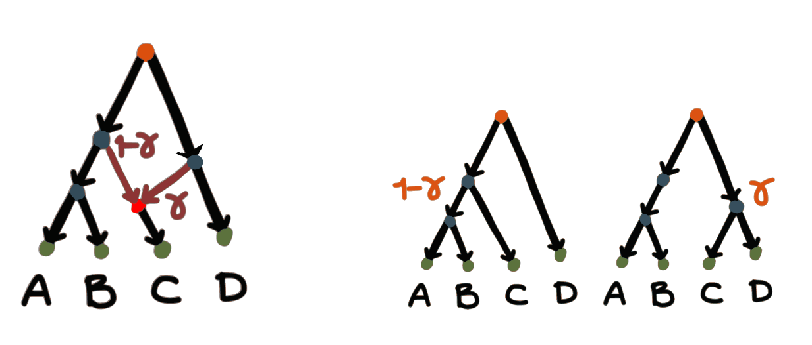

# Introduction

With PhyloNetworks installed, we can load the package and start using it to read,
manipulate, and analyze phylogenetic trees and networks in Julia.

```@repl intro
using PhyloNetworks
```

Here is a very small test to see if we correctly installed and loaded PhyloNetworks.

```@repl intro
net = readnewick("(A,(B,(C,D)));");
tiplabels(net)
```

You can see a list of all the functions with
```julia
varinfo(PhyloNetworks)
```
and press `?` inside Julia to switch to help mode,
followed by the name of a function (or type) to get more details about it.

Often you may wish to work in the directory that contains your data.
To change the directory used by julia in a session,
say the "examples" folder found in the  you have 2 options:

- quit your session, navigate to the directory and restart julia there.
- or change the working directory within your Julia session by using the `cd()`.
The following code changes the working directory to the `examples` folder
within PhyloNetworks' source directory.
```@repl intro
examples_path = joinpath(dirname(dirname(pathof(PhyloNetworks))), "examples");
cd(examples_path)
```
You will need to set the path to the folder where your data are located.


## Julia types

Each object in Julia has a *type*. We show here small examples on how to get more
info on an object.
If we want to know the type of a particular object, use `typeof`
For example, let's read a list of gene trees that come with the package.
First, we need the file name. Assuming we are in the "examples" folder:  


```@repl intro
raxmltreefile = joinpath(examples_path, "raxmltrees.tre")
# raxmltreefile = "raxmltrees.tre" # if your working directory contains the file
typeof(raxmltreefile)
```
The object `raxmltreefile` is a basic string (of letters).
Let's create our list of gene trees by reading this file.
Note that if you changed your working directory as mentioned above,
you do **not** need to use `joinpath` to join the path to the `examples` folder
with the file name.

```@repl intro
genetrees = readmultinewick(raxmltreefile); # the semicolon suppresses info on the result
typeof(genetrees)
```
which shows us that `genetrees` is of type `Vector{HybridNetwork}`, that is,
a vector containing networks.
If we want to know about the attributes the object has, we can type `?` in Julia,
followed by `HybridNetwork` for a description.

Typing `varinfo()` will provide a list of objects and packages in memory,
including `raxmltreefile` and `genetrees` that we just created.

## Quick start

Here we could check the length of our list of gene trees, as a check for correctness
to make sure we have all gene trees we expected, and check that the third tree
has whatever taxon names we expected:

```@repl intro
length(genetrees)
tiplabels(genetrees[3])
```

We can also see some basic information on the third gene tree, say:
```@repl intro
genetrees[3]
```
To visualize any of these gene trees, use the
[PhyloPlots](https://github.com/juliaphylo/PhyloPlots.jl) package:
```@repl intro
using PhyloPlots
using RCall # hide
mkpath("../assets/figures") # hide
R"name <- function(x) file.path('..', 'assets', 'figures', x)" # hide
R"svg(name('inputdata_gene3.svg'), width=4, height=3)" # hide
R"par"(mar=[0,0,0,0])                          # hide
plot(genetrees[3]); # tree for 3rd gene
R"dev.off()"                                   # hide
nothing # hide
```


## Phylogenetic networks
In phylogenetics, there two types of networks:

**Explicit** networks have a biological interpretation:
internal nodes represent ancestral species (or populations);
the main evolutionary history is depicted by the "major tree".
Various methods that estimate explicit networks use models
that account for ILS and for gene tree estimation error.



**Implicit** networks are typically descriptive:
internal nodes do *not* represent ancestral species.
Implicit networks do not discriminate between ILS,
gene flow/hybridization or gene tree estimation error,
and can be hard to interpret biologically.

```@raw html

```

In PhyloNetworks, we consider **explicit** phylogenetic networks exclusively.

## Extended newick format

In parenthetical format, internal nodes can have a name, like node `C` below,
in a tree written as `(A,B)C` in newick format:

```@raw html

```

To represent networks in parenthetical format, the extended newick format splits
each hybrid node into two nodes with the same name:

```@raw html

```

By convention, the hybrid tag is `# + H,LGT,R + number`, and the minor
hybrid edge leads to a leaf.

Thus, we get: `(((A,(B)#H1),(C,#H1)),D);`. We can write inheritance
probabilities in the parenthetical format:
`(C,#H1):branch length:bootstrap support:inheritance probability`.

We can read a network from a newick-formatted string,
and, for example, print a list of its edges:

```@repl intro
newickstring = "(((A,(B)#H1),(C,#H1)),D);";
net = readnewick(newickstring);
printedges(net)
```

We see that the edges do not have branch lengths,
and the hybrid edges do not have gamma (inheritance) values.
We can set them with

```@repl intro
setlength!(net.edge[1], 1.9)
setgamma!(net.edge[3],  0.8)
printedges(net)
```
where 1 and 3 correspond to the position of the given edge to modify in the list of edges.
We can only change the γ value of hybrid edges,
not tree edges (for which γ=1 necessarily).
Such an attempt below will cause an error with a message to explain that
the edge was a tree edge:
```julia
setgamma!(net.edge[4], 0.7)
# should return this:
# ERROR: cannot change gamma in a tree edge
```
